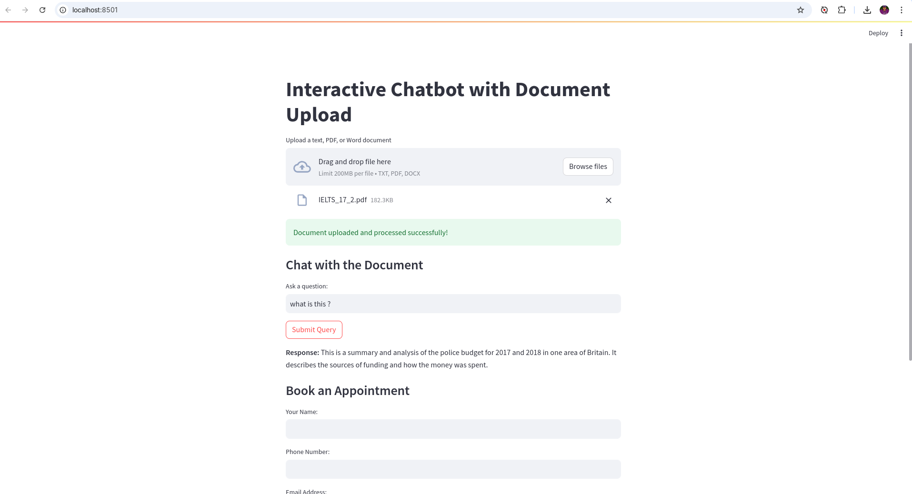
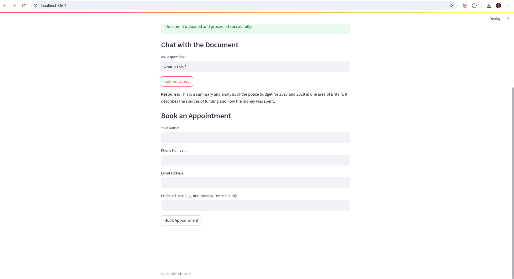

# Document Query Chatbot

This project implements an interactive chatbot using Streamlit, which allows users to upload text, PDF, or Word documents, query the document for information, and even book appointments via a conversational interface.

## About the App

The **Interactive Chatbot with Document Upload** is designed to allow users to interact with documents in a conversational manner. The app extracts the text from uploaded files and enables users to ask questions or extract relevant information directly from the document. In addition to querying the document, the app provides users with the ability to book appointments by submitting their details through a simple chat interface.

This chatbot utilizes a combination of advanced natural language processing (NLP) techniques, machine learning, and document parsing libraries to deliver a smooth and efficient experience for the users.

## Technologies Used

1. **Streamlit**: The app's user interface is built using Streamlit, which allows rapid development of interactive web applications with Python. It is lightweight and easy to use for building data science and machine learning applications.
   
2. **Google Generative AI**: Integrated for advanced NLP tasks, such as understanding and responding to user queries. Google’s powerful language models are used to process and analyze the content extracted from uploaded documents.

3. **LangChain**: This library is used to manage the flow of information between the document and the user queries. LangChain helps with document querying and retrieving the most relevant answers from the text.

4. **Document Parsing Libraries**:
   - **PyPDF2**: Used for extracting text from PDF documents.
   - **python-docx**: Used for extracting text from Word documents.

5. **Appointment Booking**: The app uses Python forms to collect user data (name, email, phone number, and preferred appointment date) and process appointment booking via the chatbot interface.

6. **Python-dotenv**: Helps securely load environment variables, such as Google Cloud credentials, for the integration with Google APIs.

7. **DateParser**: Used to handle date-related queries in the appointment booking system, ensuring proper date formatting and understanding user inputs.

## Features

* **Document Upload**: Users can upload text files, PDFs, or Word documents, and the system extracts text from them.
* **Document Query**: After uploading, users can ask questions about the document, and the chatbot will attempt to provide relevant answers.
* **Appointment Booking**: Users can provide their name, phone number, email, and preferred date for booking an appointment.

## Prerequisites

Make sure you have the following installed:
* Python 3.7+
* Google Cloud Service account credentials (for Google Generative AI integration)

## Installation

1. **Clone the Repository**:
```bash
git clone https://github.com/uditmahato/chat_bot.git
cd chat_bot
```

2. **Set Up a Virtual Environment** (optional but recommended):
```bash
python3 -m venv env
source env/bin/activate  # On Windows use `env\Scripts\activate`
```

3. **Install Dependencies**:
```bash
pip install -r requirements.txt
```

4. **Set Up Google Cloud Credentials**:
* Download your Google Cloud Service Account Key in JSON format.
* Place the file in the .gitignore folder and set the environment variable `GOOGLE_APPLICATION_CREDENTIALS` to its path:
```bash
export GOOGLE_APPLICATION_CREDENTIALS="/path/to/sharp-agent-392105-bf6377f9f1c7.json"
```

## Running the Application

After setting up the environment, you can run the application with:
```bash
streamlit run app.py
```

Visit the URL provided in your terminal (typically http://localhost:8501/) to access the app.

## Screenshots

### App Interface


### Appointment Booking



## Requirements

```
streamlit==1.26.0
langchain==0.3.13
langchain-community==0.3.13
google-generative.ai==0.8.3
pydantic==2.10.4
phonenumbers==8.13.52
PyPDF2==3.0.1
python-docx==1.1.2
dateparser==1.2.0
langchain-google-genai==2.0.7
faiss-cpu==1.9.0
pydantic[email]

```

## Notes

* If you encounter issues with Google API authentication, ensure that the `GOOGLE_APPLICATION_CREDENTIALS` environment variable is properly set.
* To add more file types or modify the chatbot's behavior, you can adjust the respective functions in the code.

## License

This project is licensed under the MIT License.
